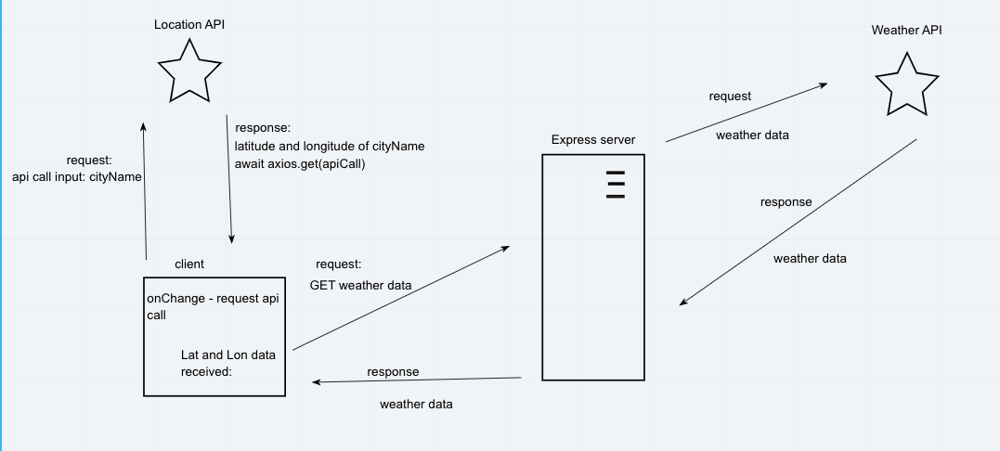
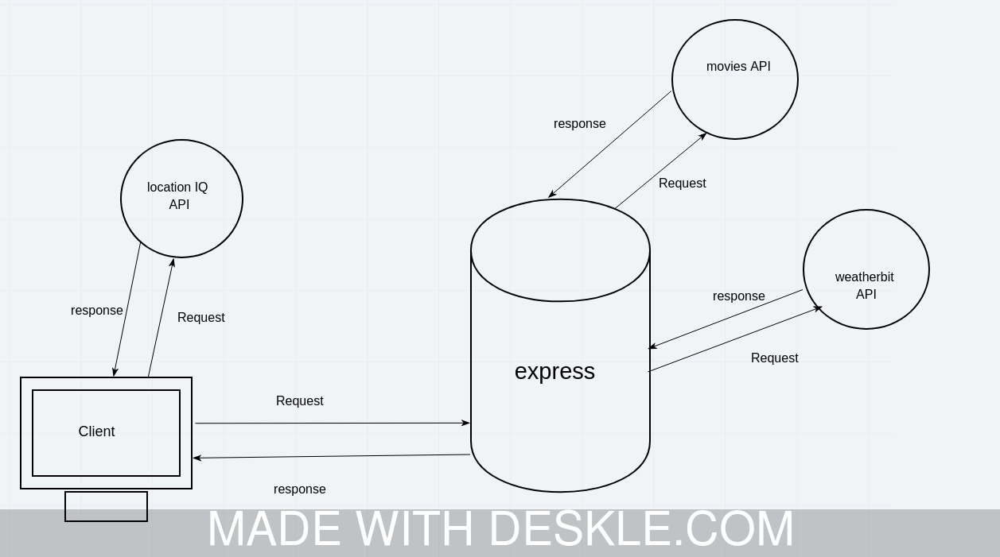
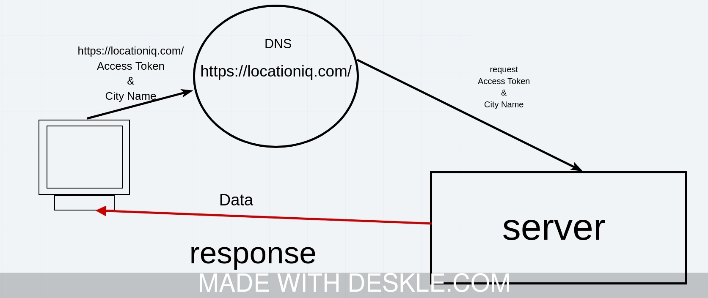
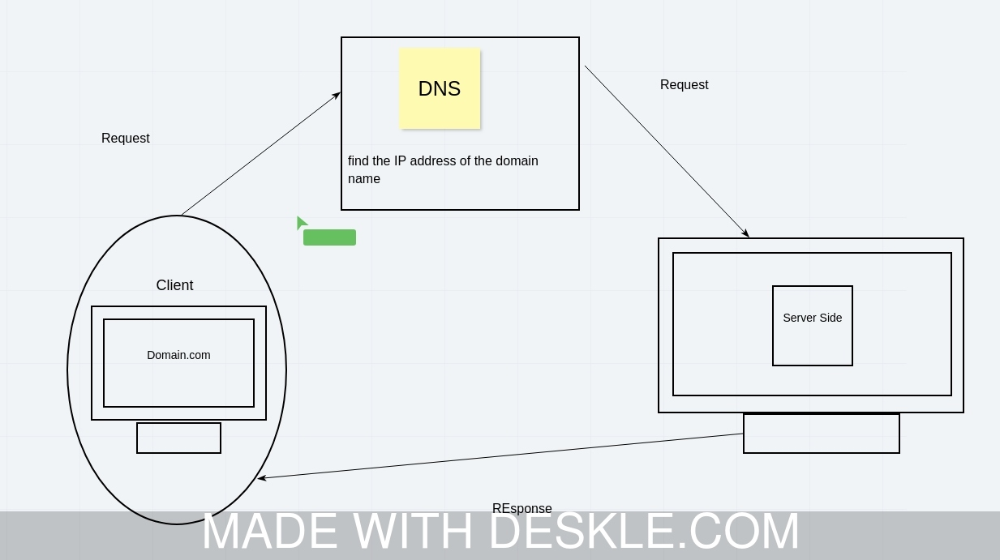

# City-Explorer App 

&nbsp;

## - Author: Mohammad Altamimi Version: 1.0.0

&nbsp;

## Overview
City Explorer is a website that can display the terrain of a city or an area. It is build so that you can travel to wherever you want and see whatever place you wish to visit right from your home at the comfort of your seat.

&nbsp;

## Getting Started
Create a new empty repo.
follow these steps on trello after signing up : [Steps] (https://trello.com/b/Sc2iNmif)
and then publish it on netlify

&nbsp;

## Architecture
In this application; I utilized React JS to build and structure the website. I used Axios to help me access data from the API. I used bootstrap to help me design the website.

&nbsp;

&nbsp;

&nbsp;

&nbsp;

&nbsp;

&nbsp;

&nbsp;

&nbsp;

## Change Log
02/05/2021 7:10 pm - Application now has a fully-functional map service. 03/05/2021 5:35 pm - Application now doesn't display map's placeholder on default + error message updated.

&nbsp;

## Credit and Collaborations
Trello: For providing steps to follow.
LocationIQ: For providing the JSON data.

&nbsp;

&nbsp;

# Name of feature and time estimations:

&nbsp;

## 1. Asynchronous code, and APIs
create the GeoSearch - map Feature

---
- Estimate of time needed to complete: 4 hours

- Start time: 3:00

- Finish time: 7:00

- Actual time needed to complete: 4 hours: 45 mins

&nbsp;

## 2. deploy static data
---

- Estimate of time needed to complete: 3 hours

- Start time: 3:00

- Finish time:6:00

- Actual time needed to complete: 5 hours: 30 mins

&nbsp;

## 3. applying some styles with bootstrap
---

- Estimate of time needed to complete: 2 hours

- Start time: 6:00

- Finish time:8:00

- Actual time needed to complete: 3 hours: 20 mins

&nbsp;

## 4. Custom Servers with Node and Express
---

- Estimate of time needed to complete: 8 hours

- Start time: 2:30

- Finish time:9:15

- Actual time needed to complete: 7 hours: 15 mins

&nbsp;

## 5. added Cache
---

- Estimate of time needed to complete: 6 hours

- Start time: 2:30

- Finish time:8:32

- Actual time needed to complete: 2 hours :35 mins

<!-- # Getting Started with Create React App

This project was bootstrapped with [Create React App](https://github.com/facebook/create-react-app).

## Available Scripts

In the project directory, you can run:

### `npm start`

Runs the app in the development mode.\
Open [http://localhost:3000](http://localhost:3000) to view it in the browser.

The page will reload if you make edits.\
You will also see any lint errors in the console.

### `npm test`

Launches the test runner in the interactive watch mode.\
See the section about [running tests](https://facebook.github.io/create-react-app/docs/running-tests) for more information.

### `npm run build`

Builds the app for production to the `build` folder.\
It correctly bundles React in production mode and optimizes the build for the best performance.

The build is minified and the filenames include the hashes.\
Your app is ready to be deployed!

See the section about [deployment](https://facebook.github.io/create-react-app/docs/deployment) for more information.

### `npm run eject`

**Note: this is a one-way operation. Once you `eject`, you can’t go back!**

If you aren’t satisfied with the build tool and configuration choices, you can `eject` at any time. This command will remove the single build dependency from your project.

Instead, it will copy all the configuration files and the transitive dependencies (webpack, Babel, ESLint, etc) right into your project so you have full control over them. All of the commands except `eject` will still work, but they will point to the copied scripts so you can tweak them. At this point you’re on your own.

You don’t have to ever use `eject`. The curated feature set is suitable for small and middle deployments, and you shouldn’t feel obligated to use this feature. However we understand that this tool wouldn’t be useful if you couldn’t customize it when you are ready for it.

## Learn More

You can learn more in the [Create React App documentation](https://facebook.github.io/create-react-app/docs/getting-started).

To learn React, check out the [React documentation](https://reactjs.org/).

### Code Splitting

This section has moved here: [https://facebook.github.io/create-react-app/docs/code-splitting](https://facebook.github.io/create-react-app/docs/code-splitting)

### Analyzing the Bundle Size

This section has moved here: [https://facebook.github.io/create-react-app/docs/analyzing-the-bundle-size](https://facebook.github.io/create-react-app/docs/analyzing-the-bundle-size)

### Making a Progressive Web App

This section has moved here: [https://facebook.github.io/create-react-app/docs/making-a-progressive-web-app](https://facebook.github.io/create-react-app/docs/making-a-progressive-web-app)

### Advanced Configuration

This section has moved here: [https://facebook.github.io/create-react-app/docs/advanced-configuration](https://facebook.github.io/create-react-app/docs/advanced-configuration)

### Deployment

This section has moved here: [https://facebook.github.io/create-react-app/docs/deployment](https://facebook.github.io/create-react-app/docs/deployment)

### `npm run build` fails to minify

This section has moved here: [https://facebook.github.io/create-react-app/docs/troubleshooting#npm-run-build-fails-to-minify](https://facebook.github.io/create-react-app/docs/troubleshooting#npm-run-build-fails-to-minify) -->
